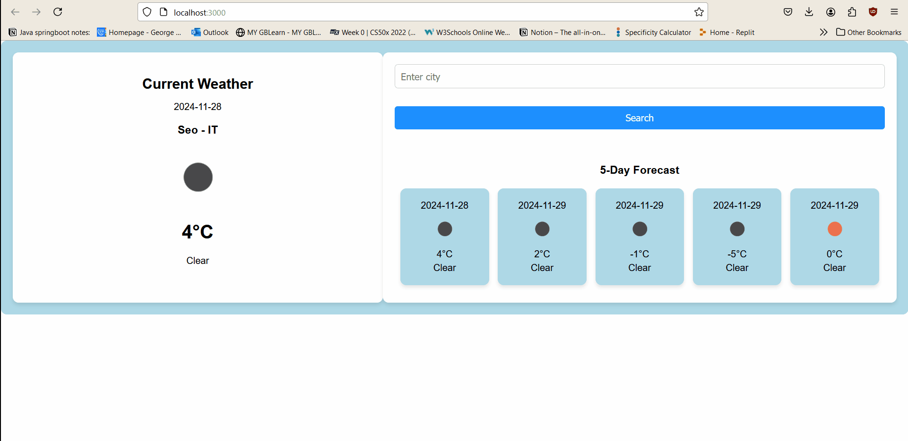

# Weather App

A simple weather app built with React that fetches real-time weather data and displays the current weather along with a 5-day forecast.

## Demo



## Features
- Fetches current weather data based on city input.
- Displays the 5-day weather forecast.
- Shows weather icons for different weather conditions (e.g., clear, cloudy, etc.).


## Installation

1. Clone the repository:
   ```bash
   git clone https://github.com/HardikKumariscoding/COMP-3123/tree/master/101410993_comp3123_labtest2

2.   Install dependencies:

        cd weather-app
        npm install

3. Run the app locally:        

        npm start


4. Open the app in your browser:

    Visit http://localhost:3000 to see the weather app in action. 


Technologies Used

    React
    OpenWeather API
    CSS/HTML